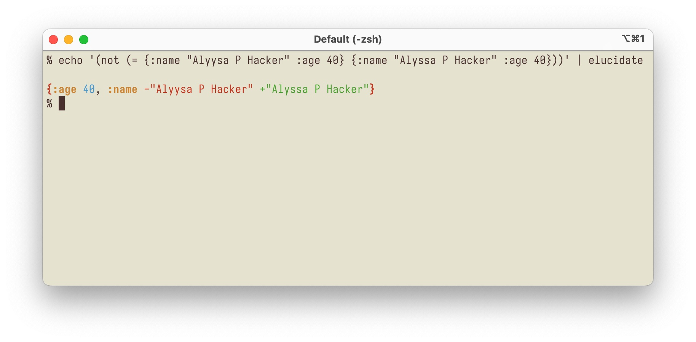

# elucidate

*Explain clojure.test assertion failures without dependencies*

"Unleash the power of copy-and-paste"



## Installation

You need to install [bbin](https://github.com/babashka/bbin):

```
brew install babashka/brew/bbin
```

and

```
echo 'export PATH="$PATH:$HOME/.babashka/bbin/bin"' >> ~/.$(basename $SHELL)rc && exec $SHELL
```

With that out of the way, you can now use bbin to install elucidate:

```
bbin install io.github.pesterhazy/elucidate
```

## Usage

One step at a time. By default, the output of clojure.test assertions can be hard to read:

```
user=> (is (= {:foo 1 :bar 2} {:foo -1 :bar 2}))

FAIL in () (NO_SOURCE_FILE:1)
expected: (= {:foo 1, :bar 2} {:foo -1, :bar 2})
  actual: (not (= {:foo 1, :bar 2} {:foo -1, :bar 2}))
```

So let's copy what comes after `actual:` to the clipboard. The clipboard should now contain this string:

```
(not (= {:foo 1, :bar 2} {:foo -1, :bar 2}))
```

Now you can pipe the result into `elucidate`:

```
pbpaste | elucidate
```

The output looks like this:


## Why?

clojure.test/is prints failures in a concise, readable way. But when checking equality of maps, it's sometimes hard to spot differences. Tools like  and [humane-test-output](https://github.com/pjstadig/humane-test-output) change the test runner to pretty-print failures. While this works great, it has a few disadvantages:

- Pretty-printing output doesn't always make the result more readable
- Extra dependencies are needed
- Complexity is added

`elucidate` takes the opposite approach. When a test fails, you copy-and-paste the failure output into a separate program. This gives you an optional way to make the output more digestible without adding complexity to the test runner. It works with Clojure/ClojureScript/babashka.

## Future work

Currently only `=` is supported. Future extensions could include:

- `not=`
- `submap?`

## Credit

All the actual work is done by [deep-diff2](https://github.com/lambdaisland/deep-diff2).
